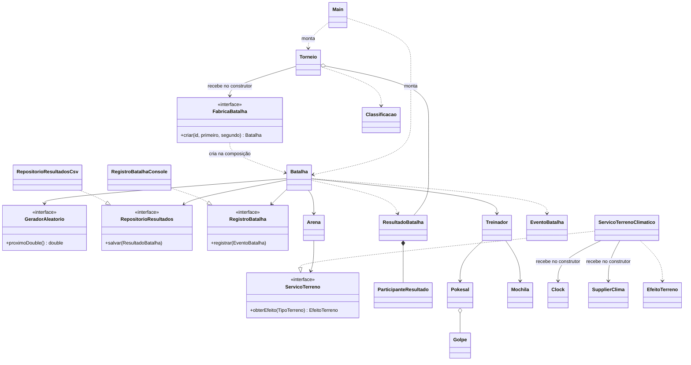
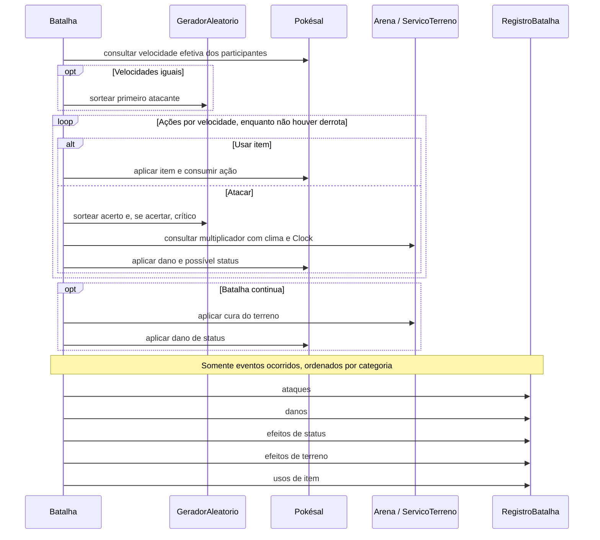
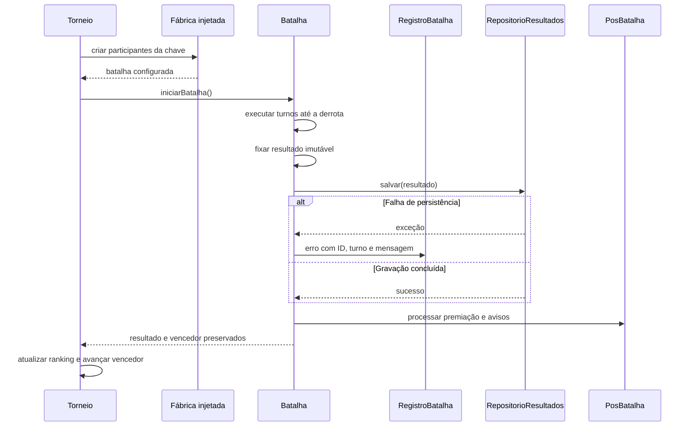
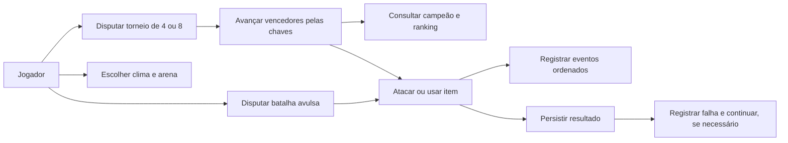

# Diagramas da Fase 03

## Classes e dependências

```mermaid
classDiagram
  class GeradorAleatorio {
    <<interface>>
    +proximoDouble() double
  }
  class ServicoTerreno {
    <<interface>>
    +obterEfeito(TipoTerreno) EfeitoTerreno
  }
  class RepositorioResultados {
    <<interface>>
    +salvar(ResultadoBatalha)
  }
  class RegistroBatalha {
    <<interface>>
    +registrar(EventoBatalha)
  }
  class FabricaBatalha {
    <<interface>>
    +criar(id, primeiro, segundo) Batalha
  }
  Main ..> Torneio : monta
  Main ..> Batalha : monta
  Torneio --> FabricaBatalha : recebe no construtor
  FabricaBatalha ..> Batalha : cria na composição
  Torneio o-- ResultadoBatalha
  Torneio ..> Classificacao
  Batalha --> GeradorAleatorio
  Batalha --> RepositorioResultados
  Batalha --> RegistroBatalha
  Batalha --> Arena
  Batalha --> Treinador
  Batalha ..> EventoBatalha
  Batalha ..> ResultadoBatalha
  ResultadoBatalha *-- ParticipanteResultado
  Treinador --> Pokesal
  Treinador --> Mochila
  Pokesal o-- Golpe
  Arena --> ServicoTerreno
  ServicoTerrenoClimatico ..|> ServicoTerreno
  ServicoTerrenoClimatico --> Clock : recebe no construtor
  ServicoTerrenoClimatico --> SupplierClima : recebe no construtor
  ServicoTerrenoClimatico ..> EfeitoTerreno
  RepositorioResultadosCsv ..|> RepositorioResultados
  RegistroBatalhaConsole ..|> RegistroBatalha
```

## Sequência 1 — turno completo de batalha

```mermaid
sequenceDiagram
  participant B as Batalha
  participant G as GeradorAleatorio
  participant P as Pokésal
  participant A as Arena / ServicoTerreno
  participant L as RegistroBatalha
  B->>P: consultar velocidade efetiva dos participantes
  opt Velocidades iguais
    B->>G: sortear primeiro atacante
  end
  loop Ações por velocidade, enquanto não houver derrota
    alt Usar item
      B->>P: aplicar item e consumir ação
    else Atacar
      B->>G: sortear acerto e, se acertar, crítico
      B->>A: consultar multiplicador com clima e Clock
      B->>P: aplicar dano e possível status
    end
  end
  opt Batalha continua
    B->>A: aplicar cura do terreno
    B->>P: aplicar dano de status
  end
  Note over B,L: Somente eventos ocorridos, ordenados por categoria
  B->>L: ataques
  B->>L: danos
  B->>L: efeitos de status
  B->>L: efeitos de terreno
  B->>L: usos de item
```

## Sequência 2 — registro do resultado no torneio

```mermaid
sequenceDiagram
  participant T as Torneio
  participant F as Fábrica injetada
  participant B as Batalha
  participant L as RegistroBatalha
  participant R as RepositorioResultados
  participant P as PosBatalha
  T->>F: criar participantes da chave
  F-->>T: batalha configurada
  T->>B: iniciarBatalha()
  B->>B: executar turnos até a derrota
  B->>B: fixar resultado imutável
  B->>R: salvar(resultado)
  alt Falha de persistência
    R-->>B: exceção
    B->>L: erro com ID, turno e mensagem
  else Gravação concluída
    R-->>B: sucesso
  end
  B->>P: processar premiação e avisos
  B-->>T: resultado e vencedor preservados
  T->>T: atualizar ranking e avançar vencedor
```

## Casos de uso acrescentados

```mermaid
flowchart LR
  Jogador --> Avulsa[Disputar batalha avulsa]
  Jogador --> Torneio[Disputar torneio de 4 ou 8]
  Jogador --> Clima[Escolher clima e arena]
  Torneio --> Chaves[Avançar vencedores pelas chaves]
  Chaves --> Ranking[Consultar campeão e ranking]
  Avulsa --> Batalha[Atacar ou usar item]
  Chaves --> Batalha
  Batalha --> Registro[Registrar eventos ordenados]
  Batalha --> Resultado[Persistir resultado]
  Resultado --> Falha[Registrar falha e continuar, se necessário]
```
